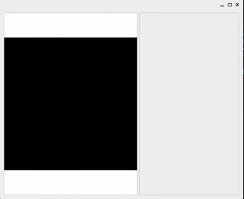
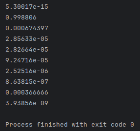
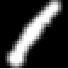

# Simple neural network project



---

## description

this is basic implementation for execution and studying fully connected neural networks (further FCNN) designed as a library

---

## functionality
 in this lib implemented
 
 - io for FCNN: save\load to\from binary file
 - execution: after load you can execute it with some input layer
 - learning: you can study your own FCNN (you only need to find a dataset)
 - dataset preprocessing: you can crop every image to input size to make classification easier

---

## API

### Basic API

basic api includes

 - forward: just passing the input layer through the net, and returning resulting layer
```cpp
mkl_BLAS_impl::mat simple_conv::forward(const mkl_BLAS_impl::mat& input_layer, const net& net_);
```

<div style="display: flex; align-items: center; gap: 20px;">
  
    ==>
  
</div>

 - creating unlearnt network: just creating network with certain shape and random weights and biases
```cpp
net simple_conv::generate_empty_net(const std::vector<int> &shapes);
```

 - learning: allows you to learn your model on some dataset and set up gradient descend parameters

 ```cpp
 void simple_conv::learning::apply_gradient_descend(net &net, 
                            const boost::filesystem::path &dataset_path,
                            bool show_progress = false,
                            float grad_weight = .1f,
                            int epoch_ = 1000,
                            int dev_size = 1000,
                            int sample_size = -1,
                            int check_period = 10,
                            int batch_size = 0,
                            int patience = 15,
                            float decay_factor = .7f);
 ```
   
 - IO: you can save/load your network, save/load dataset, preprocess image for your net forward
```cpp
    namespace simple_conv::io {
        mkl_BLAS_impl::mat
        load_dataset(const boost::filesystem::path &filename, bool transposed = false,
                     char delimiter = ',', bool has_header = true);

        void save_dataset(const boost::filesystem::path &filename, mkl_BLAS_impl::mat& data, char delimiter = ',');

        cv::Mat read_img_to_input_layer(const boost::filesystem::path &path, bool invert = false, bool normalize = false);

        void save_net(const net &net, const boost::filesystem::path &path);

        net read_net(const boost::filesystem::path &path);
    }
```

 - preprocessing: allows you to crop dataset images (in detail in implementation)
```cpp
void simple_conv::preprocessing::preprocess_dataset(const boost::filesystem::path& in, const boost::filesystem::path& out);
 ```

---

## extended API

if you wanna use some features from simple_conv::learning::learning_private (that are used in learning) in [<learning_private.h>](https://github.com/tinunadno/FC_neural_networks_library/blob/master/src/learning_private.h) file you can find stuff used in the learning process:

```cpp
namespace simple_conv::learning::learning_private {

    void forward_propagation(const mkl_BLAS_impl::mat &input_layer, const net &net,
                             std::vector<mkl_BLAS_impl::mat> &hidden_layers);


    void backward_propagation(const std::vector<mkl_BLAS_impl::mat>& hidden_layers,
                              const mkl_BLAS_impl::mat& one_hot,
                              const mkl_BLAS_impl::mat& train_inputs,
                              net& gradient,
                              const net& net_,
                              mkl_BLAS_impl::mat& delta); //! Ps left delta as an argument for outer access

    void one_hot(const mkl_BLAS_impl::mat &labels, mkl_BLAS_impl::mat &one_hot_mtx);

    void get_predictions(const mkl_BLAS_impl::mat &last_layer, mkl_BLAS_impl::mat &predictions);

    float get_accuracy(const mkl_BLAS_impl::mat &labels, const mkl_BLAS_impl::mat &predictions);

    float get_cross_entropy(const mkl_BLAS_impl::mat &labels, const mkl_BLAS_impl::mat &predictions);

} // learning_private
```

---

## examples

in [examples directory](https://github.com/tinunadno/FC_neural_networks_library/blob/master/examples) you can find some usage examples like 

 - [simple usage](https://github.com/tinunadno/FC_neural_networks_library/blob/master/examples/usage_exmple/main.cpp)
 - [weights visualization](https://github.com/tinunadno/FC_neural_networks_library/blob/master/examples/weights_visualization/main.cpp)
 - [*how your net see's perfect one*](https://github.com/tinunadno/FC_neural_networks_library/blob/master/examples/net_inverse/main.cpp)
 - [learning and preprocess example](https://github.com/tinunadno/FC_neural_networks_library/blob/master/examples/learning_example/main.cpp)
 - [cool gui](https://github.com/tinunadno/FC_neural_networks_library/blob/master/examples/gui_example/main.cpp)

---

## Performance

### learning

1 epoch for net with shape 784*10*10 and dataset with size 42000*784 on my old laptop takes about ~.08 seconds.

same thing with numpy takes about .12-.18 seconds, so I guess it's fine :D

### dataset loading

for dataset with shape 42000*785 (with labels) takes about 2.5 seconds (with converting to mat structure)

same thing with pandas takes about 2.5-2.7 seconds

---

## implementation

### linear algebra

I've implemented a [tiny highly optimized mathematical library](https://github.com/tinunadno/FC_neural_networks_library/blob/master/src/blas_impl.cpp) designed to linear algebra operations
in the context of neural networks. It uses Intel MKL (Math Kernel Library) for maximum performance on the CPU, 
and also uses some parallel computing features via OpenMP.

All the operations are performed with [mat](https://github.com/tinunadno/FC_neural_networks_library/blob/master/src/blas_impl.h) 
struct, it supports OpenCV Mat convertion, so it allows me to manually manage resources, use opencv features and MKL fast la implementation.

### IO

to quickly load huge datasets I made [optimized csv dataset loading](https://github.com/tinunadno/FC_neural_networks_library/blob/master/src/io.cpp).
 It maps file into the memory and manually filling dataset mat avoiding unnecessary and slow abstractions. (But only works on linux systems)

I've also implemented [IO for neural networks](https://github.com/tinunadno/FC_neural_networks_library/blob/master/src/io.cpp), it just writes/read 'em to a binary file

### preprocessing

in [preprocessing.cpp](https://github.com/tinunadno/FC_neural_networks_library/blob/master/src/preprocessing.cpp) I've implemented "cropping" it cropping and scales learning dataset to input layer scale: 


converting to contours


calculating roi


cropping, scaling, and adding blur



that way you can reduce dataset size, because you don't need to add training examples with displaced objects, and still correctly classify them in any image part

### learning

I've implemented [backward propagation and basic gradient descend](https://github.com/tinunadno/FC_neural_networks_library/blob/master/src/learning.cpp) and some additional stuf required for back prob and gradient descend

To implement model training, whole dataset is loaded to a huge matrix. Before learning starts, class labels are converted to the one-hot encoding format for partial derivative of the error function from the last layer calculation.

After one-hot calculation, a full forward pass is performed through the neural network, the network outputs are calculated immediately for the entire dataset.

Then the error is propagated backwards, during which the gradients of all trained network parameters are calculated relative to temporary and resulting layers from forward propagation.

Then the gradient descend is applied.

This process is repeated many times and that way achieving accuracy function increase.
